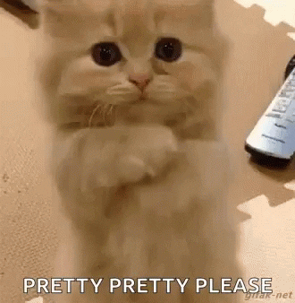

## Gif Tastic Project:

Click any button and you get giphy of that animal. You can even add more animal get the giphy for them.
You can click on giphy to play and stop.

---

To make this project have to get **_API_**
key from [giphy.com](giphy.com)



#### Technologis used

<ul>

- HTML
- css(boot strap)
- JavaScript
  - jQuery

</ul>
 
_____________

#### Screeenshot:


#### Code:

Used \$.ajax call:

```
   $.ajax({

       url : queryURL,
       method :"GET"

   })
   .then(function(response){

    console.log(response);
   }

```
